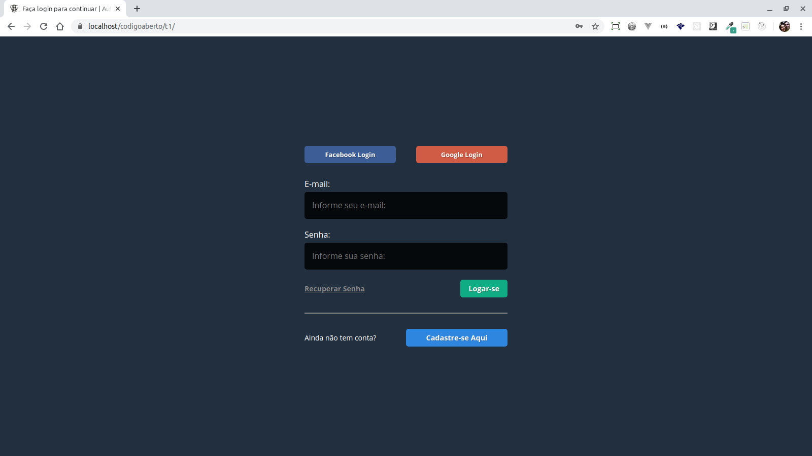

<h1 align="center">
    
</h1>

<h3 align="center">
  Login Social com PHP OO
</h3>

  

  

## :rocket: Sobre o Projeto  

Construir uma página de login social utilizando boas práticas de PHP OO.

---

## Pagina Home

## Stack
* PHP